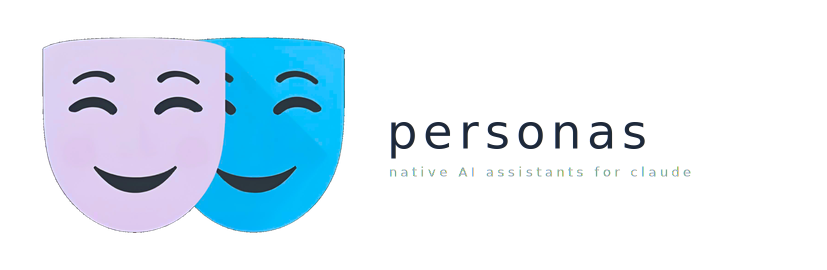

<p align="center">
  
</p>

<p align="center">
  <a href="LICENSE"></a>
</p>

Independent, self-contained AI agent personas built with native Claude features first. Accessible from CLI and Claude Cowork.

Hello! Personas are my take on a simple and elegant Claw-like (lol) framework using native abilities for Claude.

```
$ warren "how am I doing this month?"

📊 Through March 22:

You're at $4,280 of your $5,500 monthly spend target — 78%, with
8 days left. Dining is the outlier again: $620 vs $400 budget.

  Savings rate: 31%  Net worth: +2.1% MoM  Emergency fund: 5.8 months

That Vanguard rebalance we talked about last week — rates moved
enough that it's worth doing now. Want me to draft the trades?
```

### What's a persona?

A persona is simply a folder. Isolated from your global Claude config, backed by git, and ready to launch from any terminal. Inside:

```
~/.personas/warren/
├── CLAUDE.md                     # what the persona does, knows, and how it behaves
├── .claude/
│   ├── settings.json             # sandbox, permissions, memory config
│   ├── output-styles/            # personality and tone (replaces default Claude prompt)
│   └── hooks/
│       └── public-repo-guard.sh  # blocks personal data leaks in public repos
├── hooks.json                    # session lifecycle: start, stop, compaction, git guard
├── docs/                         # reference materials, plans, domain knowledge
├── skills/                       # reusable workflows (self-improve ships with every persona)
├── tools/                        # scripts, utilities, data pipelines
├── user/
│   ├── profile.md                # your personal context (filled during first session)
│   └── memory/                   # native auto-memory (local, git-tracked)
├── .mcp.json                     # MCP server connections (gitignored)
├── .claude-flags                 # per-persona launch flags
└── .gitignore                    # protects secrets; optionally ignores user/ for public sharing
```

Everything is created with you during setup — persona-dev interviews you, researches your domain, and scaffolds the whole thing. Keep it local, connect it to GitHub for backup, or deploy it to a remote server. Launch

<!-- TODO:  -->

Each persona stores its launch flags in `.claude-flags`, configured during setup:

- **Sandboxed** — can only read/write its own directory
- **Permission bypass** — runs autonomously (only when sandboxed)
- **Chrome** — browser automation for personas that need it
- **Remote control** — accessible from Claude Desktop or other apps

Once running, personas extend themselves. They learn with native auto-memory, schedule reminders and timed checks with natural language ("remind me at 3pm to..."), and may ask to create additional files to track data or workflows. Every persona ships with a self-improvement skill — it can develop new skills, create tools, and keep itself organized with periodic audits.

<!-- TODO:  -->

> [!TIP]
> Want your personas to talk to each other or run on remote servers? [Bridgey](https://github.com/kickinrad/bridgey) adds inter-agent communication via A2A protocol and optional remote deployment with Docker, Tailscale, and Coolify.

### Example personas

These are all examples of actual personas I created and use to help organize my busy life. In theory, a persona could be an expert assistant with pretty much whatever you want. 

| Persona | Role | MCP Servers | Skills |
|---------|------|-------------|--------|
| **warren** | Personal CFO — sharp, data-driven, Buffett-esque | Monarch (finances), Google Workspace | `finance`, `self-improve` |
| **julia** | Personal Chef — warm, encouraging, meal planning pro | Mealie (recipes & meal plans), Google Workspace | `personal-chef`, `self-improve` |
| **nara** | Health & Wellness Coach — holistic, evidence-based | Consensus (research papers), HealthEx (health data), Google Workspace | `wellness`, `self-improve` |
| **bob** | Home Repair Expert — project scoping + how-to guides | Excalidraw (diagrams), Google Workspace | `home-repair`, `calculators`, `self-improve` |

You can also use ANY other Claude Code plugin or skill with a persona. Just add the marketplace as you would normally, or add them directly to the persona directory.

## Quick Start

### Dependencies

| Dependency | Platform | Why |
|------------|----------|-----|
| [Claude Code](https://docs.anthropic.com/en/docs/claude-code) | All | Required — the foundation |
| [bubblewrap](https://github.com/containers/bubblewrap) + [socat](http://www.dest-unreach.org/socat/) | Linux / WSL2 | Required — OS-level sandboxing (`sudo apt install bubblewrap socat`) |
| [Git for Windows](https://gitforwindows.org/) | Windows | Required — provides Git Bash runtime |
| [gh](https://cli.github.com/) | All | Optional — repo creation during setup + public repo safety checks |

### Step 1: Install the plugin

Install persona-manager once — after that, every persona you create auto-installs it.

<details open>
<summary><strong>Claude Code (CLI)</strong></summary>

```
/plugin marketplace add kickinrad/personas
/plugin install persona-manager@personas
```

</details>

<details open>
<summary><strong>Claude Cowork</strong></summary>

1. **Customize** → **Personal Plugins +** → **Browse Plugins**
2. **+ Add Marketplace from GitHub** → enter `kickinrad/personas`
3. Install and enable **persona-manager** (and any expansion packs you want)

</details>

### Step 2: Create a persona

Describe the persona you want — a role, a name, and optionally a personality. The `persona-dev` skill activates automatically.

<details open>
<summary><strong>Claude Code (CLI)</strong></summary>

1. Start a Claude Code session in any directory
2. Type your persona description in the prompt:

```
create a personal finance persona named warren
```

</details>

<details open>
<summary><strong>Claude Cowork</strong></summary>

1. Create a new Cowork instance starting in your home directory
2. Type your persona description in the prompt:

```
create a personal finance persona named warren
```

</details>

persona-dev scaffolds everything to `~/.personas/warren/` — sandbox config, hooks, output style, self-improve skill, and gitignore. It asks whether you'll use CLI, Cowork, or both, and configures paths, aliases, and MCP servers accordingly.

### Step 3: Launch your persona

Once created, the persona works in any environment:

| Mode | How |
|------|-----|
| CLI | `warren` or `warren "how am I doing this month?"` — shell aliases set up during creation |
| Cowork | Select `~/.personas/warren/` as project folder |


If the persona uses MCP servers, persona-dev offers to configure them in your `claude_desktop_config.json` so Cowork and Desktop Chat can access them too.

On first launch, the persona interviews you to build your profile — it asks the right questions based on its role, then writes `user/profile.md` from your answers. Every session after that, it reads your profile and memory and picks up where you left off.

### Cross-platform notes

- **macOS / Linux** — CLI and Desktop share `~/`, so `~/.personas/` works everywhere. No extra setup.
- **Windows (native)** — Personas live at `%USERPROFILE%\.personas\`. No bash aliases — use PowerShell functions or launch via Desktop. No sandbox support, so `--dangerously-skip-permissions` is never used.
- **WSL** — CLI runs in WSL (`/home/user/`) while Desktop sees `C:\Users\user\`. If you use both, persona-dev creates personas on the Windows side and symlinks `~/.personas/` in WSL so both environments see the same files. If you only use CLI, personas stay in WSL for better I/O performance.

### Expansion packs

The base plugin is intentionally focused and simple. Expansion packs add optional functionality — install them via the `/plugin` menu while talking to your persona.

| Pack | What it does |
|------|-------------|
| **persona-dashboard** | HTML dashboard with task tracking, profile viewer, memory browser, and system overview |

## How It Works

Under the hood, personas use six hooks, a self-improve skill, OS-level sandboxing, and native auto-memory to stay useful without staying stupid. Here's what's going on.

### Profile & First Session

On first launch, the SessionStart hook detects an unfilled `user/profile.md` and kicks off an interview. The persona asks structured questions based on its role — a finance persona asks about accounts and goals, a chef asks about dietary preferences and kitchen setup. Answers are written to `user/profile.md` in place. Every session after that, the hook reads the populated profile so the persona has full context from the start.

### Memory

Personas remember things between sessions using native auto-memory in `user/memory/`:

- **Auto-capture** — Claude's built-in memory writes to `user/memory/` via `autoMemoryDirectory` in `settings.local.json`
- **Session persistence** — Stop and PreCompact hooks remind the persona to save meaningful learnings before the session ends or context compacts
- **Crash recovery** — StopFailure hook writes a crash marker (`.last-crash`); PostCompact hook checks for it on the next session so lost context can be recovered
- **Index** — `MEMORY.md` acts as an index pointing to topic-specific memory files, loaded at the start of every session

Memory is local, git-tracked, and lives inside the persona's sandbox. No external services involved.

### Output Styles

Personality and tone live in `.claude/output-styles/`, separate from the rules in CLAUDE.md. This is a deliberate split — CLAUDE.md defines *what the persona does* (role, procedures, skills, security rules), while the output style defines *who the persona is* (voice, opinions, humor, character). Changing how a persona sounds doesn't touch its operational config, and vice versa.

### Self-Improvement

Personas ship with a `self-improve` skill that drives evolution beyond memory:

1. **Rule promotion** — after a pattern appears 3+ times in memory, the persona proposes a permanent rule in CLAUDE.md
2. **Skill creation** — after an ad-hoc workflow repeats 3+ times, the persona drafts a reusable skill
3. **Tool & integration discovery** — researches MCP servers, CLI tools, APIs, and expansion packs; creates skills to wrap them, agents for autonomous subtasks, hooks for behavioral automation, and scripts for data processing — always preferring existing solutions over custom builds

Every level requires your approval before changes are committed. You stay in control; the persona does the legwork.

### Sandboxing

Each persona runs in a native OS sandbox (bubblewrap on Linux, Seatbelt on macOS) configured in `.claude/settings.json`:

```json
{
  "sandbox": {
    "enabled": true,
    "autoAllowBashIfSandboxed": true,
    "filesystem": {
      "allowWrite": ["."],
      "denyRead": ["~/.aws", "~/.ssh", "~/.gnupg", "../"]
    },
    "network": {
      "allowedDomains": ["api.anthropic.com"]
    }
  }
}
```

Personas can only write to their own directory, can't read parent directories or other personas' files, and can only reach whitelisted network domains. Each persona customizes `allowedDomains` for its own MCP servers.

> [!IMPORTANT]
> Sandboxing is not available on Windows Claude Code CLI. Windows personas run with standard permission prompts — `--dangerously-skip-permissions` is never used.

Personas accessed in Claude Desktop Cowork use Cowork's native sandboxing by default. 

### Tools & Integrations

Personas have a full toolkit available — not just MCP servers. During setup, persona-dev researches your domain and recommends the right mix:

| Type | Where it lives | Best for |
|------|---------------|----------|
| MCP servers | `.mcp.json` + sandbox allowlist | Persistent connections to external services |
| CLI tools | Documented in CLAUDE.md or wrapped in skills | Leveraging mature existing tools |
| APIs | `tools/` scripts or skill instructions | Direct HTTP calls without an MCP server |
| Skills | `skills/{domain}/{name}/SKILL.md` | Reusable workflows wrapping any of the above |
| Agents | `.claude/agents/{name}.md` | Autonomous subtasks needing their own context |
| Hooks | `hooks.json` | Behavioral automation tied to session events |
| Scripts | `tools/` | Data pipelines, formatters, utilities |
| Scheduled tasks | Natural language or `CronCreate` | Timed reminders, delayed checks |

#### Scheduling options

**In-session (CLI/Desktop)** — use natural language ("remind me at 3pm to...", "every 30 minutes, check X") or `CronCreate` directly. These are session-scoped and vanish when you exit.

**Web scheduled tasks (durable)** — create persistent, recurring tasks at [claude.ai/code](https://claude.ai/code) → **Scheduled**. Set a name, prompt, frequency, and select the persona's repo as the project. Tasks run server-side on schedule — no active session needed.

> [!IMPORTANT]
> Web scheduled tasks can only access **connected integrations** (Gmail, Calendar, etc. configured at [claude.ai/settings/connectors](https://claude.ai/settings/connectors)) — not the persona's `.mcp.json`. If your persona needs external services in scheduled runs, connect them there.

| | In-session (`CronCreate`) | Web scheduled tasks |
|---|---|---|
| Persistence | Session-scoped | Durable — survives restarts |
| MCP access | `.mcp.json` (project) | Connected integrations only |
| Platform | CLI, Desktop | Web ([claude.ai/code](https://claude.ai/code)) |
| Branch pushes | N/A | Configurable |

For MCP servers specifically:
- **CLI + Code tab** — config lives in the persona's `.mcp.json` (gitignored)
- **Desktop Chat + Cowork** — persona-dev merges servers into `claude_desktop_config.json` so all environments can access them

### Shell Aliases

Shell aliases auto-discover personas in `~/.personas/` and create callable functions. Each persona stores its launch flags in `.claude-flags` (configured during setup). During setup, persona-dev walks through each flag with the user:

- `--setting-sources project,local` — isolates persona's settings from global config
- `--dangerously-skip-permissions` — autonomous mode (only on sandboxed platforms: macOS/Linux/WSL2)

> [!CAUTION]
> Never use `--dangerously-skip-permissions` on Windows CLI without supervision — there is no OS-level sandbox to contain it. persona-dev enforces this during setup.
- `--remote-control` — enables external tool connections
- `--chrome` — enables Chrome browser automation (only for personas that need web interaction)

### Repo Safety

Personas collect personal data — your profile, preferences, and session memories live in `user/`. Every persona ships with a **public repo guard** (`.claude/hooks/public-repo-guard.sh`) that automatically blocks `git commit` and `git push` if personal data would be exposed in a public repository.

- **Private repos** — safe to commit everything, including `user/`. Great for backup and cross-machine sync
- **Public repos** — the guard checks that `user/` is gitignored, no personal files are staged, and no secret patterns (`*.env`, `*.key`, `*.pem`) are being committed. If any check fails, the commit is blocked with instructions to fix it

If you decide to share your persona, it helps to handle the transition itself — updating `.gitignore`, removing `user/` from tracking, and creating a fresh remote so old history with personal data never reaches the public repo.

> [!WARNING]
> The public repo guard is a best-effort safety net, not a guarantee. Always review what you commit and push — especially when sharing a persona publicly for the first time. You are responsible for ensuring your personal data, API keys, and credentials are not exposed. When in doubt, start with a fresh remote and never force-push history that may contain sensitive information.

## Contributing

See [CONTRIBUTING.md](CONTRIBUTING.md) for guidelines.

## Star History

[](https://star-history.com/#kickinrad/personas&Date)

## License

[Apache-2.0](LICENSE)
