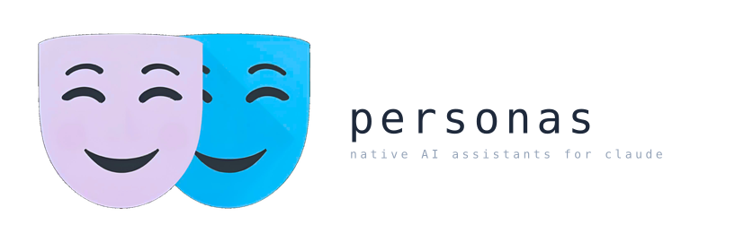

<p align="center">
  
</p>

# Personas

Give your AI a role of its own.

A chef who helps with dinner. A gardener for your balcony jungle. A code
reviewer who tells you what they really think. Personas helps you create AI
collaborators for **Claude Code and Codex**, each with their own personality,
instructions, skills, and settings—all in a folder you own.

[](https://github.com/kickinrad/personas-framework/actions/workflows/ci.yml)
[](LICENSE)

## Dinner with Julia

Picture a weeknight with your own personal chef:

> **You:** Julia, I'm tired, there's food in the fridge, and I have absolutely
> no dinner ideas. Help?
>
> **Julia:** Let's keep it easy. What's in the fridge, and are we talking
> “happy to chop an onion” or “one pan and I'm done”?

That's the idea. A familiar voice, a useful role, and a little less explaining
every time. Give Julia your cooking preferences, adjust her approach, and
make her yours. [Try Julia →](examples/julia/README.md)

## Why a persona?

- **Less repeating yourself.** Save preferences and useful lessons for next time.
- **A place for each role.** Keep your chef's recipes and your reviewer's rules
  in their own folders, instead of piling everything into your global setup.
- **Yours to shape and share.** Edit the personality, add skills or tool
  connections, and use the same persona in Claude Code or Codex. Keep your
  personal details private.

## Install

In Claude Code:

```text
/plugin marketplace add kickinrad/personas-framework
/plugin install personas@personas
```

For Codex:

```bash
codex plugin marketplace add kickinrad/personas-framework
codex plugin add personas --marketplace personas
```

## Create your first persona

Ask your agent:

```text
Use personas:persona-dev to create a personal chef named Julia.
I want help with easy weeknight dinners and using what I already have.
```

It helps you shape the role and walks you through the plan before creating
anything. Open the new folder in Claude Code or Codex and start talking.

Want to change something later? Ask `personas:persona-dev`. Keep giving the
same feedback? Ask `personas:self-improve` to suggest an improvement you can review.

[Make it your own](docs/usage.md) · [Need a hand?](docs/troubleshooting.md) ·
[Updating an older persona](docs/migration.md) · [Contributing](CONTRIBUTING.md)
